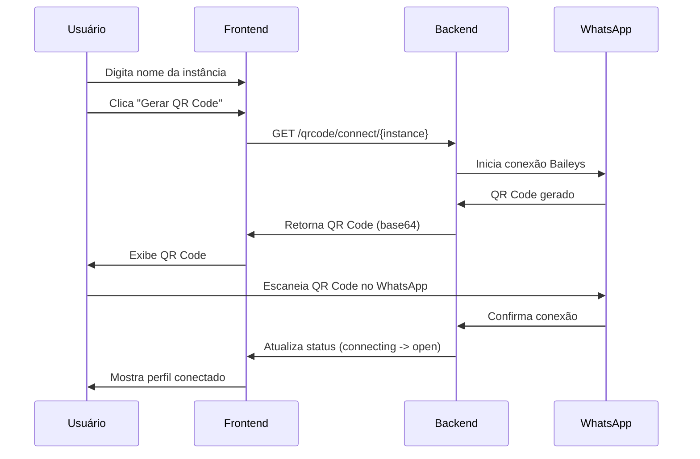

# QR Code Scanning - Evolution API

Esta documentação detalha a implementação completa do sistema de QR Code scanning do Evolution API, incluindo frontend, backend, configurações e guias de implementação para forks.

## 📋 Sumário

1. [Visão Geral](#visão-geral)
2. [Arquitetura](#arquitetura)
3. [Frontend - Interface do Usuário](#frontend---interface-do-usuário)
4. [Backend - API Endpoints](#backend---api-endpoints)
5. [Serviço WhatsApp Baileys](#serviço-whatsapp-baileys)
6. [Configurações](#configurações)
7. [Fluxo de Conexão](#fluxo-de-conexão)
8. [Casos de Uso](#casos-de-uso)
9. [Troubleshooting](#troubleshooting)
10. [Implementação para Forks](#implementação-para-forks)

## 🎯 Visão Geral

O sistema de QR Code scanning do Evolution API permite que usuários conectem suas instâncias WhatsApp de forma simples e segura através de uma interface web responsiva. O sistema suporta:

- ✅ Geração automática de QR codes
- ✅ Atualização em tempo real do status de conexão
- ✅ Interface responsiva com tema dark/light
- ✅ Sistema de logs em tempo real
- ✅ Gestão de perfil (nome, status, foto)
- ✅ Suporte a múltiplas instâncias
- ✅ Rate limiting de segurança
- ✅ Tutorial interativo para novos usuários

## 🏗️ Arquitetura

```
┌─────────────────┐    ┌─────────────────┐    ┌─────────────────┐
│   Frontend      │    │     Backend     │    │  WhatsApp API   │
│   (HTML/JS)     │◄──►│   (Node.js)     │◄──►│    (Baileys)    │
│                 │    │                 │    │                 │
│ - Interface Web │    │ - API Routes    │    │ - QR Generation │
│ - Real-time UI  │    │ - Auth System   │    │ - Connection    │
│ - Theme Toggle  │    │ - Rate Limiting │    │ - Event System  │
└─────────────────┘    └─────────────────┘    └─────────────────┘
```

## 🎨 Frontend - Interface do Usuário

### Localização dos Arquivos

```
/public/qrcode/index.html          # Interface principal
/public/qrcode/                    # Assets estáticos
/src/api/routes/qrcode.router.ts   # Routes do backend
```

### Funcionalidades da Interface

#### 1. **Formulário de Conexão**
- Campo para nome da instância
- Validação de caracteres (apenas letras, números, hífens e underscores)
- Botão "Gerar QR Code" com indicador visual

#### 2. **Display do QR Code**
- Canvas HTML5 para renderização do QR code
- Spinner de carregamento animado
- Contador regressivo (30s) para atualização automática
- Status de conexão em tempo real

#### 3. **Sistema de Logs**
- Logs em tempo real das operações
- Diferentes cores por tipo (info, success, error, warning)
- Contador de mensagens
- Scroll automático

#### 4. **Gestão de Perfil**
- Visualização das informações do WhatsApp conectado
- Edição de nome e status
- Upload de foto de perfil
- Botões para reiniciar/desconectar

#### 5. **Interface Adaptativa**
- Suporte a tema dark/light com toggle
- Design responsivo para mobile e desktop
- Tutorial interativo para novos usuários

### Tecnologias Utilizadas

```html
<!-- Principais dependências -->
<script src="https://cdn.tailwindcss.com"></script>
<script src="https://cdn.jsdelivr.net/npm/qrcode@1.5.1/build/qrcode.min.js"></script>
```

## 🔧 Backend - API Endpoints

### Routes Principais

#### **GET /qrcode/**
Serve a interface HTML principal com headers de segurança.

```typescript
// Headers de segurança implementados
res.setHeader('Content-Type', 'text/html; charset=utf-8');
res.setHeader('X-Content-Type-Options', 'nosniff');
res.setHeader('X-Frame-Options', 'DENY');
res.setHeader('X-XSS-Protection', '1; mode=block');
res.setHeader('Referrer-Policy', 'strict-origin-when-cross-origin');
```

#### **GET /qrcode/api-key**
Verifica se a API key está configurada de forma segura (sem expor a chave).

**Response:**
```json
{
  "configured": true,
  "sessionToken": "abc123...",
  "expiresIn": 3600
}
```

#### **POST /qrcode/exchange-token**
Troca um token de sessão pela API key real (rate limited).

**Request:**
```json
{
  "sessionToken": "abc123..."
}
```

**Response:**
```json
{
  "apiKey": "BQYHJGJHJ..."
}
```

#### **GET /qrcode/connect/:instanceName**
Inicia a conexão WhatsApp e gera o QR code.

**Response:**
```json
{
  "code": "2@ABC123...",
  "pairingCode": null,
  "base64": "data:image/png;base64,iVBOR...",
  "count": 1
}
```

#### **GET /qrcode/connectionState/:instanceName**
Verifica o estado atual da conexão.

**Response:**
```json
{
  "instance": {
    "instanceName": "minha-instancia",
    "state": "connecting" // connecting | open | close
  }
}
```

#### **DELETE /qrcode/logout/:instanceName**
Desconecta a instância WhatsApp.

#### **GET /qrcode/fetchInstances**
Busca informações da instância (perfil, estatísticas).

#### **POST /qrcode/updateProfileName**
Atualiza o nome do perfil.

#### **POST /qrcode/updateProfileStatus**
Atualiza o status do perfil.

#### **POST /qrcode/updateProfilePicture**
Atualiza a foto do perfil.

### Rate Limiting

O sistema implementa rate limiting para proteger contra abuso:

```typescript
const RATE_LIMIT_WINDOW = 60000; // 1 minuto
const RATE_LIMIT_MAX_REQUESTS = 10; // 10 requests por minuto
```

### Sistema de Autenticação

O sistema usa um mecanismo de dois passos para autenticação:

1. **Verificação segura**: `/api-key` retorna apenas se está configurado
2. **Troca de tokens**: Token temporário é trocado pela API key real
3. **Rate limiting**: Proteção contra força bruta

## 📱 Serviço WhatsApp Baileys

### Configuração do QR Code

```typescript
// Configurações do QR Code (src/config/env.config.ts)
export type QrCode = {
  LIMIT: number;    // Máximo de QR codes por instância (padrão: 30)
  COLOR: string;    // Cor do QR code (padrão: '#198754')
};

// Opções de geração do QR Code
const optsQrcode: QRCodeToDataURLOptions = {
  margin: 3,
  scale: 4,
  errorCorrectionLevel: 'H',
  color: {
    light: '#ffffff',
    dark: color // Cor configurável
  }
};
```

### Fluxo de Conexão

1. **Inicialização da Instância**
   ```typescript
   // Cria nova instância
   const instance = channelController.init(instanceData, options);
   ```

2. **Conexão WhatsApp**
   ```typescript
   // Conecta ao WhatsApp
   await instance.connectToWhatsapp(number);
   ```

3. **Geração do QR Code**
   ```typescript
   // Quando QR code é recebido
   if (qr) {
     this.instance.qrcode.count++;
     qrcode.toDataURL(qr, optsQrcode, (error, base64) => {
       this.instance.qrcode.base64 = base64;
       this.instance.qrcode.code = qr;
     });
   }
   ```

4. **Monitoramento de Status**
   ```typescript
   // Estados possíveis
   enum ConnectionState {
     connecting = 'connecting',
     open = 'open',
     close = 'close'
   }
   ```

### Eventos Emitidos

O sistema emite eventos através do EventEmitter2:

```typescript
// Evento de QR code atualizado
this.sendDataWebhook(Events.QRCODE_UPDATED, {
  qrcode: {
    instance: this.instance.name,
    pairingCode: this.instance.qrcode.pairingCode,
    code: qr,
    base64: base64
  }
});
```

## ⚙️ Configurações

### Variáveis de Ambiente

```bash
# QR Code
QRCODE_LIMIT=30                    # Máximo de QR codes por instância
QRCODE_COLOR=#198754              # Cor do QR code

# Autenticação
AUTHENTICATION_API_KEY=BQYHJGJHJ   # API Key para autenticação

# Configurações de sessão
CONFIG_SESSION_PHONE_CLIENT=Evolution API
CONFIG_SESSION_PHONE_NAME=Chrome
```

### Configurações do Database

O sistema suporta PostgreSQL e MySQL:

```prisma
// Para PostgreSQL
model Instance {
  id                String   @id @default(uuid())
  name              String   @unique
  integration       String?
  token             String?
  connectionStatus  String   @default("close")
  // ... outros campos
}

// Para MySQL (adaptações necessárias)
model Instance {
  id                String   @id @default(uuid())
  name              String   @unique
  integration       String?
  token             String?
  connectionStatus  String   @default("close")
  // ... outros campos
}
```

## 🔄 Fluxo de Conexão



## 🎯 Casos de Uso

### 1. **Primeira Conexão**
- Usuário cria nova instância
- Sistema gera QR code
- Usuário escaneia com WhatsApp
- Conexão estabelecida automaticamente

### 2. **Reconexão**
- Instância desconectada
- Sistema detecta mudança de status
- QR code é regenerado automaticamente
- Usuário pode reconectar

### 3. **Gestão de Múltiplas Instâncias**
- Interface permite alternar entre instâncias
- Cada instância tem QR code independente
- Logs separados por instância

### 4. **Recuperação de Erro**
- Sistema detecta falhas de conexão
- QR code é regenerado automaticamente
- Rate limiting previne abuso

## 🔍 Troubleshooting

### Problemas Comuns

#### **1. QR Code não é gerado**
```bash
# Verificar logs do backend
tail -f logs/evolution-api.log | grep -i qrcode

# Verificar se a instância existe
curl -H "apikey: YOUR_API_KEY" http://localhost:8080/instance/fetchInstances
```

#### **2. API Key não configurada**
```bash
# Verificar variável de ambiente
echo $AUTHENTICATION_API_KEY

# Configurar no .env
AUTHENTICATION_API_KEY=your_secure_api_key_here
```

#### **3. Rate limit atingido**
```bash
# Aguardar reset do rate limit (1 minuto)
# Ou verificar configuração no código
grep "RATE_LIMIT_MAX_REQUESTS" src/api/routes/qrcode.router.ts
```

#### **4. WhatsApp já conectado**
```bash
# Verificar status da conexão
curl -H "apikey: YOUR_API_KEY" http://localhost:8080/qrcode/connectionState/instance-name

# Se conectado, fazer logout primeiro
curl -X DELETE -H "apikey: YOUR_API_KEY" http://localhost:8080/qrcode/logout/instance-name
```

### Logs de Debug

```javascript
// Ativar logs detalhados
process.env.LOG_LEVEL=debug

// Verificar logs específicos
grep "qrcode\|QR\|connection" logs/evolution-api.log
```

## 🚀 Implementação para Forks

### 1. **Clonagem da Interface**

```bash
# Copiar arquivos do frontend
cp -r public/qrcode/ your-project/public/
cp src/api/routes/qrcode.router.ts your-project/src/api/routes/
```

### 2. **Configuração do Backend**

```typescript
// Adicionar rotas ao router principal
import { QrcodeRouter } from './routes/qrcode.router';

const qrcodeRouter = new QrcodeRouter(configService, ...guards);
app.use('/qrcode', qrcodeRouter.router);
```

### 3. **Configuração do WhatsApp Service**

```typescript
// Implementar método connectToWhatsapp
export class YourWhatsAppService {
  async connectToWhatsapp(instanceName: string) {
    // Sua implementação aqui
    return {
      code: qrCodeString,
      base64: base64Image,
      count: 1
    };
  }

  async getConnectionState(instanceName: string) {
    // Retornar estado da conexão
    return {
      instance: {
        instanceName,
        state: 'connecting' // connecting | open | close
      }
    };
  }
}
```

### 4. **Configuração de Segurança**

```typescript
// Implementar rate limiting
const rateLimit = (req: Request, res: Response, next: NextFunction) => {
  const clientIp = req.ip;
  const now = Date.now();
  const windowMs = 60000; // 1 minute
  const maxRequests = 10;

  // Sua lógica de rate limiting aqui
};
```

### 5. **Template HTML Personalizável**

```html
<!-- Personalizar cores e branding -->
:root {
  --primary-color: #22c55e;  /* Verde Evolution */
  --primary-hover: #16a34a;
  --success-color: #10b981;
  --error-color: #ef4444;
}

<!-- Adicionar seu logo -->

```

### 6. **Integração com WebSocket (Opcional)**

```typescript
// Para updates em tempo real
import { WebSocket } from 'ws';

export class QRCodeWebSocket {
  private wss: WebSocket.Server;

  constructor(server: any) {
    this.wss = new WebSocket.Server({ server });

    this.wss.on('connection', (ws) => {
      ws.on('message', (message) => {
        // Handle WebSocket messages
      });

      // Emitir updates de QR code
      this.emitQRCodeUpdate(ws, qrData);
    });
  }
}
```

## 📝 Checklist de Implementação

- [ ] Clonar arquivos do frontend (`public/qrcode/`)
- [ ] Configurar rotas do backend (`qrcode.router.ts`)
- [ ] Implementar serviço WhatsApp com QR code
- [ ] Configurar autenticação e rate limiting
- [ ] Personalizar interface (cores, logo, textos)
- [ ] Configurar variáveis de ambiente
- [ ] Testar fluxo completo de conexão
- [ ] Documentar endpoints específicos
- [ ] Implementar logs e monitoramento
- [ ] Configurar SSL/HTTPS para produção

## 🔐 Considerações de Segurança

1. **Rate Limiting**: Implementar para todos os endpoints
2. **CORS**: Configurar adequadamente para produção
3. **HTTPS**: Usar SSL em produção
4. **API Keys**: Nunca expor chaves no frontend
5. **Input Validation**: Validar todos os inputs
6. **Headers de Segurança**: Implementar headers HTTP de segurança

## 📚 Referências Técnicas

- [Baileys WhatsApp Web](https://github.com/WhiskeySockets/Baileys)
- [QRCode.js Library](https://github.com/soldair/node-qrcode)
- [Tailwind CSS](https://tailwindcss.com/)
- [Express.js Security](https://expressjs.com/en/advanced/best-practice-security.html)

---

**Evolution API** - Sistema de QR Code Scanning
Versão: 2.0.0
Data: 2025
