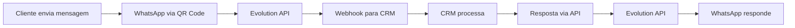
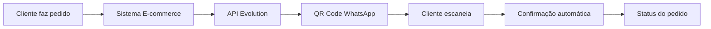

# QR Code Scanning - Casos de Uso

Este documento apresenta os principais casos de uso e cenários de implementação do sistema de QR Code scanning do Evolution API.

## 📋 Sumário

1. [Primeira Conexão](#1-primeira-conexão)
2. [Reconexão Automática](#2-reconexão-automática)
3. [Gestão de Múltiplas Instâncias](#3-gestão-de-múltiplas-instâncias)
4. [Integração com Chatbots](#4-integração-com-chatbots)
5. [Sistema de Monitoramento](#5-sistema-de-monitoramento)
6. [Recuperação de Falhas](#6-recuperação-de-falhas)
7. [Interface Personalizada](#7-interface-personalizada)
8. [Webhooks e Eventos](#8-webhooks-e-eventos)
9. [API para Desenvolvedores](#9-api-para-desenvolvedores)
10. [Cenários Avançados](#10-cenários-avançados)

## 🎯 1. Primeira Conexão

### **Cenário:** Usuário conecta WhatsApp pela primeira vez

**Fluxo:**
1. Usuário acessa interface web
2. Digita nome da instância (ex: "minha-loja")
3. Clica em "Gerar QR Code"
4. Sistema cria nova instância no banco
5. Baileys inicia conexão WhatsApp
6. QR code é gerado e exibido
7. Usuário escaneia com celular
8. Conexão é estabelecida automaticamente

**Código de exemplo:**
```javascript
// Frontend
document.getElementById('generate-qr').addEventListener('click', async () => {
  const instanceName = document.getElementById('instance').value;

  try {
    const response = await fetch(`/qrcode/connect/${instanceName}`, {
      headers: { 'apikey': API_KEY }
    });

    const data = await response.json();

    if (data.code) {
      // Gerar QR code visual
      QRCode.toCanvas(document.getElementById('qrcodeCanvas'), data.code);
    }
  } catch (error) {
    console.error('Erro na conexão:', error);
  }
});
```

**Configuração típica:**
```env
# Configurações para primeira conexão
QRCODE_LIMIT=30
QRCODE_COLOR=#22c55e
AUTHENTICATION_API_KEY=sua-chave-segura
```

## 🔄 2. Reconexão Automática

### **Cenário:** Dispositivo desconectado precisa reconectar

**Fluxo:**
1. Sistema detecta desconexão
2. Interface mostra status "Desconectado"
3. QR code é regenerado automaticamente
4. Usuário pode escanear novamente
5. Conexão é restabelecida

**Implementação:**
```typescript
// Monitoramento de status
async function checkConnectionStatus() {
  const response = await fetch(`/qrcode/connectionState/${instanceName}`, {
    headers: { 'apikey': API_KEY }
  });

  const data = await response.json();

  if (data.instance.state === 'close') {
    // Regenerar QR code automaticamente
    await generateQRCode();
    startCountdown(); // Reiniciar contador
  }
}
```

**Configuração:**
```javascript
// Configuração do contador
const COUNTDOWN_INTERVAL = 30; // segundos
const MAX_RETRY_ATTEMPTS = 5;
```

## 🏢 3. Gestão de Múltiplas Instâncias

### **Cenário:** Empresa gerencia várias contas WhatsApp

**Fluxo:**
1. Interface permite alternar entre instâncias
2. Cada instância tem QR code independente
3. Logs separados por instância
4. Status individual por conexão

**Implementação:**
```html
<!-- Interface com dropdown de instâncias -->
<select id="instance-selector">
  <option value="loja-1">Loja Principal</option>
  <option value="loja-2">Loja Filial</option>
  <option value="suporte">Suporte Técnico</option>
</select>
```

**Backend:**
```typescript
// Endpoint para listar todas as instâncias
app.get('/qrcode/instances', async (req, res) => {
  const instances = await prisma.instance.findMany({
    select: {
      name: true,
      connectionStatus: true,
      profileName: true
    }
  });

  res.json(instances);
});
```

## 🤖 4. Integração com Chatbots

### **Cenário:** Sistema conectado a chatbot para atendimento

**Fluxo:**
1. QR code conecta WhatsApp
2. Sistema de chatbot é ativado
3. Mensagens são processadas automaticamente
4. Interface mostra status do chatbot

**Integração com Typebot:**
```typescript
// Configuração Typebot
const typebotConfig = {
  enabled: true,
  apiVersion: 'old',
  sendMediaBase64: true
};

// Webhook para chatbot
app.post('/webhook/typebot', async (req, res) => {
  const { instanceName, message } = req.body;

  // Processar mensagem no Typebot
  const response = await typebotService.processMessage(message);

  // Enviar resposta via WhatsApp
  await whatsappService.sendMessage(instanceName, response);
});
```

**Interface com status do chatbot:**
```html
<div id="chatbot-status" class="status-indicator">
  <span>🤖 Chatbot: Ativo</span>
  <span>📊 Mensagens processadas: 1,234</span>
</div>
```

## 📊 5. Sistema de Monitoramento

### **Cenário:** Dashboard para monitoramento de conexões

**Fluxo:**
1. Painel mostra todas as instâncias
2. Status em tempo real (online/offline)
3. Métricas de uso e performance
4. Alertas automáticos

**Dashboard JSON:**
```json
{
  "instances": [
    {
      "name": "principal",
      "status": "open",
      "profileName": "Minha Empresa",
      "profilePicture": "https://...",
      "uptime": "99.8%",
      "messagesToday": 150,
      "lastActivity": "2025-01-15T10:30:00Z"
    }
  ]
}
```

**Métricas em tempo real:**
```javascript
// WebSocket para updates em tempo real
const wss = new WebSocket.Server({ port: 8081 });

wss.on('connection', (ws) => {
  // Enviar métricas a cada 5 segundos
  setInterval(() => {
    const metrics = getInstanceMetrics();
    ws.send(JSON.stringify(metrics));
  }, 5000);
});
```

## 🛠️ 6. Recuperação de Falhas

### **Cenário:** Sistema detecta e recupera falhas automaticamente

**Fluxo:**
1. Sistema monitora conexões continuamente
2. Falhas são detectadas automaticamente
3. Tentativas de reconexão são feitas
4. Logs detalhados são gerados

**Sistema de retry:**
```javascript
class RetryManager {
  constructor(maxAttempts = 5, baseDelay = 1000) {
    this.maxAttempts = maxAttempts;
    this.baseDelay = baseDelay;
  }

  async executeWithRetry(operation, instanceName) {
    for (let attempt = 1; attempt <= this.maxAttempts; attempt++) {
      try {
        return await operation();
      } catch (error) {
        if (attempt === this.maxAttempts) {
          throw new Error(`Falha após ${this.maxAttempts} tentativas`);
        }

        const delay = this.baseDelay * Math.pow(2, attempt - 1);
        console.log(`Tentativa ${attempt} falhou, retrying em ${delay}ms`);

        await new Promise(resolve => setTimeout(resolve, delay));
      }
    }
  }
}
```

**Monitoramento de saúde:**
```typescript
// Health check endpoint
app.get('/health/qrcode', async (req, res) => {
  const health = {
    status: 'healthy',
    timestamp: new Date().toISOString(),
    instances: {},
    uptime: process.uptime()
  };

  // Verificar cada instância
  for (const instanceName of activeInstances) {
    try {
      const state = await getConnectionState(instanceName);
      health.instances[instanceName] = {
        status: state.instance.state,
        healthy: state.instance.state === 'open'
      };
    } catch (error) {
      health.instances[instanceName] = {
        status: 'error',
        healthy: false
      };
    }
  }

  res.json(health);
});
```

## 🎨 7. Interface Personalizada

### **Cenário:** Interface adaptada para diferentes negócios

**Exemplo 1: E-commerce**
```html
<!-- Interface para loja online -->
<div class="ecommerce-theme">
  <header>
    
    <h1>Conectar WhatsApp da Loja</h1>
    <p>Automatize atendimento de pedidos</p>
  </header>

  <div class="features">
    <div class="feature">📦 Consultar pedidos</div>
    <div class="feature">💳 Status de pagamento</div>
    <div class="feature">🚚 Rastreio de entrega</div>
  </div>
</div>
```

**Exemplo 2: Clínica médica**
```html
<!-- Interface para clínica -->
<div class="medical-theme">
  <header>
    <h1>WhatsApp da Clínica</h1>
    <p>Agendamento e confirmações</p>
  </header>

  <div class="features">
    <div class="feature">📅 Agendar consultas</div>
    <div class="feature">⏰ Lembretes</div>
    <div class="feature">📋 Resultados</div>
  </div>
</div>
```

**Personalização de cores:**
```css
:root {
  --primary-color: #22c55e;    /* Verde Evolution */
  --secondary-color: #3b82f6;  /* Azul para e-commerce */
  --accent-color: #10b981;     /* Verde para sucesso */
  --danger-color: #ef4444;     /* Vermelho para erro */
}
```

## 🔗 8. Webhooks e Eventos

### **Cenário:** Sistema reage a eventos do WhatsApp

**Eventos suportados:**
```typescript
enum WhatsAppEvents {
  QRCODE_UPDATED = 'qrcode.updated',
  CONNECTION_UPDATE = 'connection.update',
  MESSAGES_UPSERT = 'messages.upsert',
  CONTACTS_SET = 'contacts.set'
}
```

**Webhook de exemplo:**
```javascript
// Webhook para QR code atualizado
app.post('/webhook/qrcode-updated', (req, res) => {
  const { instanceName, qrcode } = req.body;

  console.log(`QR Code atualizado para ${instanceName}`);

  // Notificar frontend via WebSocket
  wss.clients.forEach(client => {
    if (client.instanceName === instanceName) {
      client.send(JSON.stringify({
        type: 'qrcode_updated',
        data: qrcode
      }));
    }
  });

  res.json({ status: 'received' });
});
```

**Sistema de eventos interno:**
```typescript
// EventEmitter2 para comunicação interna
const eventManager = new EventEmitter2();

eventManager.on('qrcode.updated', (data) => {
  // Atualizar cache
  cache.set(`qrcode_${data.instanceName}`, data.qrcode);

  // Emitir para WebSocket
  emitToWebSocket('qrcode_updated', data);
});
```

## 💻 9. API para Desenvolvedores

### **Cenário:** Integração via API REST

**Criar instância via API:**
```bash
curl -X POST http://localhost:8080/instance/create \
  -H "apikey: YOUR_API_KEY" \
  -H "Content-Type: application/json" \
  -d '{
    "instanceName": "api-integration",
    "integration": "WHATSAPP-BAILEYS",
    "webhook": {
      "enabled": true,
      "url": "https://your-app.com/webhook"
    }
  }'
```

**Conectar via API:**
```bash
curl -H "apikey: YOUR_API_KEY" \
     http://localhost:8080/qrcode/connect/api-integration
```

**Monitorar status via API:**
```bash
# Verificar status
curl -H "apikey: YOUR_API_KEY" \
     http://localhost:8080/qrcode/connectionState/api-integration

# Buscar informações
curl -H "apikey: YOUR_API_KEY" \
     http://localhost:8080/qrcode/fetchInstances?instanceName=api-integration
```

**SDK JavaScript:**
```javascript
class EvolutionAPI {
  constructor(apiKey, baseUrl = 'http://localhost:8080') {
    this.apiKey = apiKey;
    this.baseUrl = baseUrl;
  }

  async connect(instanceName) {
    const response = await fetch(`${this.baseUrl}/qrcode/connect/${instanceName}`, {
      headers: { 'apikey': this.apiKey }
    });

    return await response.json();
  }

  async getStatus(instanceName) {
    const response = await fetch(`${this.baseUrl}/qrcode/connectionState/${instanceName}`, {
      headers: { 'apikey': this.apiKey }
    });

    return await response.json();
  }

  async sendMessage(instanceName, number, message) {
    const response = await fetch(`${this.baseUrl}/message/sendText/${instanceName}`, {
      method: 'POST',
      headers: {
        'apikey': this.apiKey,
        'Content-Type': 'application/json'
      },
      body: JSON.stringify({ number, text: message })
    });

    return await response.json();
  }
}
```

## 🚀 10. Cenários Avançados

### **Cenário A: Load Balancer com Múltiplas Instâncias**

**Arquitetura:**
```
┌─────────────┐    ┌─────────────┐    ┌─────────────┐
│   Load      │    │  Instance   │    │  Instance   │
│  Balancer   │───►│    A        │    │    B        │
│   (Nginx)   │    │  (Port 8080)│    │  (Port 8081)│
└─────────────┘    └─────────────┘    └─────────────┘
```

**Configuração:**
```nginx
# Nginx load balancer
upstream evolution_api {
    server localhost:8080;
    server localhost:8081;
    server localhost:8082;
}

server {
    location /qrcode/ {
        proxy_pass http://evolution_api;
        proxy_set_header Host $host;
        proxy_set_header X-Real-IP $remote_addr;
    }
}
```

### **Cenário B: Cluster Kubernetes**

**YAML de exemplo:**
```yaml
apiVersion: apps/v1
kind: Deployment
metadata:
  name: evolution-api-qrcode
spec:
  replicas: 3
  selector:
    matchLabels:
      app: evolution-api-qrcode
  template:
    metadata:
      labels:
        app: evolution-api-qrcode
    spec:
      containers:
      - name: api
        image: evolution-api:latest
        ports:
        - containerPort: 8080
        env:
        - name: AUTHENTICATION_API_KEY
          valueFrom:
            secretKeyRef:
              name: api-secrets
              key: api-key
        volumeMounts:
        - name: qrcode-storage
          mountPath: /app/public/qrcode
      volumes:
      - name: qrcode-storage
        persistentVolumeClaim:
          claimName: qrcode-pvc
```

### **Cenário C: Multi-tenant SaaS**

**Estrutura de dados:**
```sql
-- Tabela de tenants
CREATE TABLE tenants (
  id UUID PRIMARY KEY,
  name VARCHAR(255),
  api_key VARCHAR(255) UNIQUE,
  qrcode_limit INTEGER DEFAULT 30,
  created_at TIMESTAMP
);

-- Tabela de instâncias por tenant
CREATE TABLE instances (
  id UUID PRIMARY KEY,
  tenant_id UUID REFERENCES tenants(id),
  name VARCHAR(255),
  connection_status VARCHAR(50),
  UNIQUE(tenant_id, name)
);
```

**Middleware de tenant:**
```typescript
// Middleware para identificar tenant
const tenantMiddleware = async (req, res, next) => {
  const apiKey = req.headers.apikey;

  if (!apiKey) {
    return res.status(401).json({ error: 'API key required' });
  }

  const tenant = await prisma.tenant.findUnique({
    where: { api_key: apiKey }
  });

  if (!tenant) {
    return res.status(401).json({ error: 'Invalid API key' });
  }

  req.tenant = tenant;
  next();
};
```

## 📈 Métricas e Analytics

### **Dashboard de métricas:**

**Endpoint de métricas:**
```javascript
app.get('/metrics/qrcode', async (req, res) => {
  const metrics = {
    totalInstances: await getTotalInstances(),
    activeInstances: await getActiveInstances(),
    qrCodesGenerated: await getQRCodesGenerated(),
    connectionSuccessRate: await getConnectionSuccessRate(),
    averageConnectionTime: await getAverageConnectionTime(),
    errorsByType: await getErrorsByType()
  };

  res.json(metrics);
});
```

**Métricas em tempo real:**
```json
{
  "timestamp": "2025-01-15T10:30:00Z",
  "instances": {
    "total": 150,
    "active": 142,
    "inactive": 8
  },
  "qrcode": {
    "generated_today": 25,
    "success_rate": "96.2%",
    "average_scan_time": "12.5s"
  },
  "errors": {
    "connection_timeout": 3,
    "invalid_qr": 1,
    "rate_limited": 0
  }
}
```

## 🔄 Fluxos de Integração

### **Fluxo com CRM:**



### **Fluxo com E-commerce:**



## 📚 Exemplos Práticos

### **Exemplo 1: Integração com React**

```jsx
import React, { useState, useEffect } from 'react';
import QRCode from 'qrcode.react';

function WhatsAppQRCode({ instanceName, apiKey }) {
  const [qrCode, setQrCode] = useState(null);
  const [status, setStatus] = useState('disconnected');
  const [logs, setLogs] = useState([]);

  useEffect(() => {
    connectToWhatsApp();
    const interval = setInterval(checkStatus, 3000);
    return () => clearInterval(interval);
  }, []);

  const connectToWhatsApp = async () => {
    try {
      const response = await fetch(`/qrcode/connect/${instanceName}`, {
        headers: { 'apikey': apiKey }
      });

      const data = await response.json();
      setQrCode(data.code);

      addLog('info', 'QR Code gerado com sucesso');
    } catch (error) {
      addLog('error', `Erro: ${error.message}`);
    }
  };

  const checkStatus = async () => {
    try {
      const response = await fetch(`/qrcode/connectionState/${instanceName}`, {
        headers: { 'apikey': apiKey }
      });

      const data = await response.json();
      setStatus(data.instance.state);

      if (data.instance.state === 'open') {
        addLog('success', 'WhatsApp conectado!');
      }
    } catch (error) {
      addLog('error', `Erro ao verificar status: ${error.message}`);
    }
  };

  const addLog = (type, message) => {
    setLogs(prev => [...prev, { type, message, timestamp: new Date() }]);
  };

  return (
    <div className="whatsapp-qr-container">
      <h2>Conectar WhatsApp</h2>

      {status === 'connecting' && qrCode && (
        <div className="qr-code-section">
          <QRCode value={qrCode} size={256} />
          <p>Escaneie o QR Code com seu WhatsApp</p>
        </div>
      )}

      {status === 'open' && (
        <div className="connected-section">
          <div className="success-icon">✅</div>
          <h3>WhatsApp Conectado!</h3>
        </div>
      )}

      <div className="logs-section">
        <h4>Logs</h4>
        <div className="logs">
          {logs.map((log, index) => (
            <div key={index} className={`log-${log.type}`}>
              [{log.timestamp.toLocaleTimeString()}] {log.message}
            </div>
          ))}
        </div>
      </div>
    </div>
  );
}
```

### **Exemplo 2: Bot de Notificação**

```javascript
// Bot que notifica sobre status do QR Code
class QRCodeNotificationBot {
  constructor(webhookUrl) {
    this.webhookUrl = webhookUrl;
  }

  async notifyQRCodeGenerated(instanceName, qrCode) {
    await this.sendNotification({
      type: 'qrcode_generated',
      instanceName,
      qrCode,
      message: `Novo QR Code gerado para ${instanceName}`,
      timestamp: new Date().toISOString()
    });
  }

  async notifyConnected(instanceName) {
    await this.sendNotification({
      type: 'connected',
      instanceName,
      message: `✅ WhatsApp conectado com sucesso: ${instanceName}`,
      timestamp: new Date().toISOString()
    });
  }

  async notifyDisconnected(instanceName) {
    await this.sendNotification({
      type: 'disconnected',
      instanceName,
      message: `❌ WhatsApp desconectado: ${instanceName}`,
      timestamp: new Date().toISOString()
    });
  }

  async sendNotification(payload) {
    try {
      await fetch(this.webhookUrl, {
        method: 'POST',
        headers: { 'Content-Type': 'application/json' },
        body: JSON.stringify(payload)
      });
    } catch (error) {
      console.error('Erro ao enviar notificação:', error);
    }
  }
}
```

---

**Evolution API** - QR Code Use Cases
Versão: 2.0.0
Data: 2025
